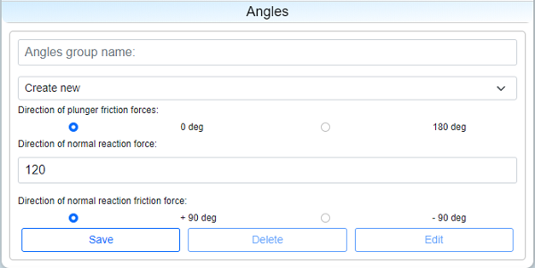

# ForceCalc

## Description

This app allows to calculate unknown reactions of supports and moment vector of the beam that loaded from the left by spring and has a smooth support at the right.

Software could be used by automotive designers that produce car's switches especially on the design stage. Switches like power window switches


or parking brake switch


ets.

This scheme reflects a simplified model of regular switches used inside cars.

.jpg)


It is a mechanical scheme that consists of:

 - two journal bearings (A & B) with free movement along X axis;
 - smooth support C at the right end of the beam;
 - beam placed between supports A & C; 
 - spring that generate external linear load on the beam's left side.

Contact field describes friction between beam and support C. First column is a friction coefficient (as an assumption we use [dry friction](https://en.wikipedia.org/wiki/Friction) laws). "X coordinate" and “Y coordinate” columns define position (mm) of support C compared to coordinate origin marked as purple circle.


Plunger field describes interaction between beam and supports A & B. First column is a friction coefficient (dry friction laws assumption is also applied here). “Distance A” indicates distance between B & C (mm), while “Distance B” - distance between A & B (mm).


Spring field describes linear spring characteristics (based on [Hooke's law](https://en.wikipedia.org/wiki/Hooke%27s_law)). “Stiffness” column contains spring [stiffness](https://en.wikipedia.org/wiki/Stiffness) in (N/mm), “Free length” - the length of the spring when uncompressed, “Length” - the length of the compressed spring.


Angles field consists of the following:  “Direction of normal reaction force” is an orientation of smooth support, “Direction of plunger friction forces” and “Direction of normal reaction friction force” are directions where friction forces were applied. The relative motion of the beam occurs in the directions opposite to friction forces.



The usage of this software allows us to:
 1. Calculate normal reaction at the end of the beam (smooth support C) to avoid accumulating contact stress so that we could analyze robustness and reliability of a switch.
 2. Find a flexible solution based on versatility of tactile feelings that would satisfy the customer needs. 

To solve the issues mentioned above our beam is constantly being pushed by spring from the left end, reflecting the force to smooth support at the right end. This force creates haptic torque that could be felt while pushing or pulling the switch. Reactions applied from each support are depicted as arrows, with direction of force shown by arrowheads.

At the same time the beam doesn't move anywhere while we change it's position by hand being in a static balance that allows us to find unknown variables (forces):
 - _Ra_ - reaction on support A;
 - _Rb_ - reaction on support B;
 - _NR_ - normal reaction on support C.

 \(1)

where _α0_ - direction of _Ra_, _α1_ - direction of _Rb_, _α2_ - direction of _NR_, _β0_ - direction of friction force in A support, _β1_ - direction of friction force in B support, _β2_ - direction of friction force in C support, _f_ - friction coefficient in A & B support, _μ_ - friction coefficient in C support, _a_ - length between A & B, _b_ - length between B & C, _LOAD_ - external load generated from a spring.

## Project Structure

### .github

In `.github` folder you can find workflow [force.yml](.github/workflows/force.yml) that has an instructions for testing project after pushing the code to main branch. It runs [test.py](force/tests.py) test where we check calculated variable _Ra_, _Rb_ and _NR_ by putting it to equations \(1). For project we should additionally install _numpy_ package for python:
```
pip install numpy
```

### SECRET_KEY

In `SECRET_KEY` folder we have generated by django a key. And each time when we run server in cmd by `python manage.py runserver` we should open and read the key:
```
with open('SECRET_KEY/ForceCalc.txt') as f:
    SECRET_KEY = f.read().strip()
```

### ForceApp

In `ForceApp` you can find [settings.py](ForceApp/settings.py) where LOGIN_URL, STATIC_URL is specified. Variable LOGIN_URL we use in pair with [@login_required](https://docs.djangoproject.com/en/3.2/topics/auth/default/#django.contrib.auth.decorators.login_required) decorator. You can find its usage in [views.py](force/views.py). STATIC_URL is pointing on place where [static](force/static) files are located.

### force

 - [`static`](force/static)
 - [`templates`](force/templates)
 - [admin.py](force/admin.py)
 - [models.py](force/models.py)
 - [tests.py](force/tests.py)
 - [urls.py](force/urls.py)
 - [views.py](force/views.py)

#### models

In project models we define **User**, **Mail** (user creates subject, writes a body of a mail and send it to recipients), **Flag** (keeps track of what is a status of a mail or it was read or archived), **Project** (fields like project_number, project_name, assembly_number that describe a project are assigned here), **Contact** (defines a set of contact parameters inside a choosen project), **Plunger** (defines a set of plunger parameters), **Spring** (defines a set of spring parameters), **Angles** (defines a set of angles parameters).

Also we define a set of validators that will attache to corresponding models, _validate_project_number_, _validate_assembly_number_, _validate_fractional_, _validate_positive_, _plungerFric_validation_, _validate_contact_angle_.

There are two main classes in addition:
 - _calc_forces_;
 - _calc_torque_.

**calc_forces.solver()** method does directly a calculation of reactions in system of equations (1) by using _np.array()_ and _np.linalg.solve()_ methods. 

**calc_forces.corrected_forces()** method corrects a direction for reactions in A and B supports.

**calc_torque** class is used for calculating a resulting torque in C support. A magnitude and a sign of the value is important. Torque depending of the lever of switch actuating gives us a tactile feedback.

**calc_torque.solver()** - is a method that allows to find third component of torque vector. calc_torque.intersection() method of finding the minimal distances from origin to force vectors in support C.

#### admin

In the [admin.py](force/admin.py) we register our models and specify a view for User and Mail, for "user_permissions" and "recipients" fields we define a filter_horizontal attribute.

#### tests

In [tests.py](force/tests.py) we create a test user, project and parameters (contact, plunger, spring, angles). Then passing parameters through calc_forces.solver() we find unknowns _Ra_, _Rb_, _NR_ that will go directly to equations. Therefore we check correctness of calculation.

#### [urls](force/urls.py) 

Project has 10 pages:
 1. '' - start page.
 2. 'login' - login page.
 3. 'logout' - logout page.
 4. 'register' - register page.
 5. 'mail/inbox' - page with inbox mail.
 6. 'mail/compose' - page for writing an email.
 7. 'mail/sent' - page of sent mail.
 8. 'mail/archived' - page of archives mail.
 9. 'change_password' - page for changing a password.
 10. 'calculation/<int:project_num>' - calculation page.

API Routes:
 - project routes:
   1. 'projects/<str:query>' - used for searching a project.
   2. 'new_project' - used for creating a new project.
 - mail routes:
   1. 'compose' - route for creating a new message.
   2. 'unread' - route for calculating a number of unread emails.
   3. 'email/<str:mailbox>/<int:email_id>' - retrieving an email content and changing status read/unread, archived/unarchived.
   4. 'mailbox/<str:query>/<str:mailbox>' - searching for email in corresponding mailbox inbox/sent/archived.
 - calculation routes:
   1. 'parameter/<str:name>/<int:project_num>' - get, save, change or delete parameter.
   2. 'result' - getting a calculated results.

#### templates

[templates](force/templates) include static html renders.

#### views

Here is all logic of the site, in particular html rendering, django forms setting and so on.

One of the functions is _parse_from_js()_ that takes request.body as arguments and convert it to regular python dictionary. Used in three cases:
 - creating new project;
 - creating new parameter (contact/plunger/spring/angles);
 - change parameter.

_ProjectForm_, _ContactForm_, _PlungerForm_, _SpringForm_, _AnglesForm_, _PasswordChangeForm2_ - are a forms inherited from model forms in some forms we define custom id and class for bootstrap.

Render views are:
1. index. Render starting page.
2. login_view. Render logine page.
3. register. Render registration page.
4. password_change. Render page for changing a password.
5. mail. Render a mail page.
6. calculation. Render calculation page.

Table of functions that receive requests
| Input | func | GET Output | POST Output | PUT Output | DELETE Output |
| :--- | :--- | :--- | :--- | :--- | :--- |
| request | [index](force/views.py#L95) | [index.html](force/templates/force/index.html), [ProjectForm](force/views.py#L42) | none | none | none |
| request | [login_view](force/views.py#L102) | [login.html](force/templates/force/login.html) | [redirect to index](force/views.py#L115) \| [login.html](force/templates/force/login.html), errors: [1](force/views.py#L118) | none | none |
| request | [logout_view](force/views.py#L123) | [redirect to index](force/views.py#L128) | none | none | none |
| request | [register](force/views.py#L130) | [register.html](force/templates/force/register.html) | [redirect to index](force/views.py#L133) \| errors: [1](force/views.py#L146), [2](force/views.py#L157) | none | none |
| request | [password_change](force/views.py#L163) | [password_change.html](force/templates/force/password_change.html), [password_change](force/views.py#L167) | [redirect to login](force/views.py#L178) \| [password_change.html](force/templates/force/password_change.html), errors: [password_change](force/views.py#L181) | none | none |
| request | [mail](force/views.py#L188) | [mail.html](force/templates/force/mail.html) | none | none | none |
| request | compose | none | message \| (errors) error | none | none |
| request | unread | count | none | none | none |
| request, mailbox, email_id | email | Flag.serialize() \| (errors) error | none | message | none |
| request, query, mailbox | mailbox | count, Flag.read's \| (errors) error | none | none | none |
| request | new_project | none | message \| (errors) errors | none | none |
| request, query | projects | count, Project.serialize()'s | none | none | none |
| request | result | REACTION, FRICTION_DIRECTION, DIRECTION, TORQUE, INTERSECTION \| (error) | none | none | none |
| request, project_num | calculation | calculation.html, project, Contacts, Plungers, Springs, Angles | none | none | none |
| request, name, project_num | parameter | (Contact \| Plunger \| Spring \| Angles).serialize() \| (errors) var1, var2, var3 | key, id \| (errors) disclaimer, errors | message \| (errors) disclaimer, errors | message \| (errors) disclaimer |
