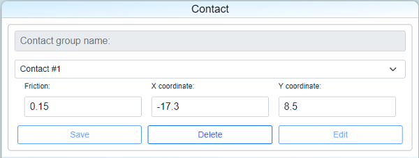
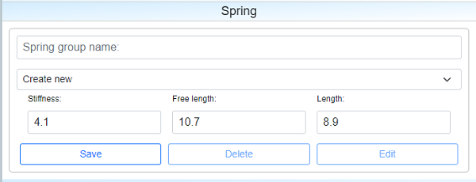

# ForceCalc

## Description

This app allows to calculate reactions of supports and vector of moment caused when the beam is being pushed from the left side by the spring having smooth support at the right side.

Software could be used by automotive designers that produce car's switches, like power window switch or parking brake switch on the pictures below. 


This scheme reflects section of a regular parking brake switch used inside cars.

.jpg)


Below there is simplified mechanical scheme of switches' zoomed part that consists of:

 - two journal bearings (A & B) with free movement along X axis;
 - smooth support C at the right end of the beam;
 - beam placed between supports A & C; 
 - spring that generate external linear load on the beam's left side.

We can find this scheme on the canvas of the calculation page. It is changeable depending on parameters input in the fields contact/plunger/spring/angles.
 


Contact field describes friction between beam and support C. First column is a friction coefficient (as an assumption we use [dry friction](https://en.wikipedia.org/wiki/Friction) laws). "X coordinate" and “Y coordinate” columns define position (mm) of support C compared to coordinate origin marked as purple circle.



Plunger field describes interaction between beam and supports A & B. First column is a friction coefficient (dry friction laws assumption is also applied here). “Distance A” indicates distance between B & C (mm), while “Distance B” - distance between A & B (mm).


Spring field describes linear spring characteristics (based on [Hooke's law](https://en.wikipedia.org/wiki/Hooke%27s_law)). “Stiffness” column contains spring [stiffness](https://en.wikipedia.org/wiki/Stiffness) in (N/mm), “Free length” - the length of the spring when uncompressed, “Length” - the length of the compressed spring.



Angles field consists of the following:  “Direction of normal reaction force” is an orientation of smooth support, “Direction of plunger friction forces” and “Direction of normal reaction friction force” are directions where friction forces were applied. The relative motion of the beam occurs in the directions opposite to friction forces.


The usage of this software allows us to:
 1. Calculate normal reaction at the end of the beam (smooth support C) to avoid accumulating contact stress so that we could analyze robustness and reliability of a switch.
 2. Find a flexible solution based on versatility of tactile feelings that would satisfy the customer needs. 

To solve the issues mentioned above our beam is constantly being pushed by spring from the left end, reflecting the force to smooth support at the right end. Reactions applied from each support are depicted as arrows, with direction of force shown by arrowheads.

At the same time normal reaction creates haptic torque that could be felt while pushing or pulling the switch. Magnitude and sign of moments' value are important. Torque depending on the switch actuating lever gives us tactile feedback. 

At the same time the beam doesn't move anywhere while we change it's position by hand being in a static balance that allows us to find unknown variables (forces):
 - _Ra_ - reaction on support A;
 - _Rb_ - reaction on support B;
 - _NR_ - normal reaction on support C.

 \(1)

where _α0_ - direction of _Ra_, _α1_ - direction of _Rb_, _α2_ - direction of _NR_, _β0_ - direction of friction force in A support, _β1_ - direction of friction force in B support, _β2_ - direction of friction force in C support, _f_ - friction coefficient in A & B support, _μ_ - friction coefficient in C support, _a_ - length between A & B, _b_ - length between B & C, _LOAD_ - external load generated from a spring.

## Project Structure

### .github

In `.github` folder you can find workflow [force.yml](.github/workflows/force.yml) that has instructions for testing project after pushing the code to main branch. It runs [test.py](force/tests.py) test where we check calculated variables _Ra_, _Rb_ and _NR_ by putting them to equations \(1). To run this  application we should additionally install _numpy_ package for python:
```
pip install numpy
```

### SECRET_KEY

In `SECRET_KEY` folder there is a key generated by django. Each time when we run server in cmd by `python manage.py runserver` we should open and read the key by doing the following in settings.py:
```
with open('SECRET_KEY/ForceCalc.txt') as f:
    SECRET_KEY = f.read().strip()
```

### ForceApp

In `ForceApp` you can find [settings.py](ForceApp/settings.py) where LOGIN_URL, STATIC_URL are specified. Variable LOGIN_URL is used together with [@login_required](https://docs.djangoproject.com/en/3.2/topics/auth/default/#django.contrib.auth.decorators.login_required) decorator. You can find its' usage in [views.py](force/views.py). STATIC_URL indicates the place where [static](force/static) files are located.

### force

 - [`static`](force/static)
 - [`templates`](force/templates)
 - [admin.py](force/admin.py)
 - [models.py](force/models.py)
 - [tests.py](force/tests.py)
 - [urls.py](force/urls.py)
 - [views.py](force/views.py)

#### models

In project models we define **User**, **Mail** (user creates subject, writes mail's body and sends it to recipients), **Flag** (keeps track of mail's  status, read or archived), **Project** (fields like project_number, project_name, assembly_number that describe project are assigned here), **Contact** (defines a set of contact parameters inside a chosen project), **Plunger** (defines a set of plunger parameters), **Spring** (defines a set of spring parameters), **Angles** (defines a set of angle parameters).

A set of validators is also defined, attached to corresponding models, _validate_project_number_, _validate_assembly_number_, _validate_fractional_, _validate_positive_, _plungerFric_validation_, _validate_contact_angle_.

Additionally there are two main classes:
 - _calc_forces_;
 - _calc_torque_.

**calc_forces.solver()** function directly calculates reactions in system of equations (1) by using _np.array()_ and _np.linalg.solve()_ methods. 

**calc_forces.corrected_forces()** function corrects direction for reactions in A and B supports.

**calc_torque** class calculates resulting moment in "purple circle" (origin). 

**calc_torque.solver()** function allows us to find third component of moment vector. 

**calc_torque.intersection()** function finds minimal distances between origin and force vectors in support C.

#### admin

In [admin.py](force/admin.py) we register our models and customize User and Mail fields, for "user_permissions" and "recipients" fields we define a filter_horizontal attribute.

#### tests

In [tests.py](force/tests.py) we create test user, project and parameters (contact, plunger, spring, angles). By inputting parameters to calc_forces.solver() we find unknowns _Ra_, _Rb_, _NR_ that will directly go to equations. Therefore correctness of calculation is checked.

#### [urls](force/urls.py) 

Project has 10 pages:
 1. '' - start page.
 2. 'login' - login page.
 3. 'logout' - logout page.
 4. 'register' - register page.
 5. 'mail/inbox' - page with inbox mail.
 6. 'mail/compose' - page for writing an email.
 7. 'mail/sent' - page of sent mail.
 8. 'mail/archived' - page of archived mail.
 9. 'change_password' - page for changing password.
 10. 'calculation/<int:project_num>' - calculation page.

API Routes:
 - project routes:
   1. 'projects/<str:query>' - searching a project.
   2. 'new_project' - creating a new project.
 - mail routes:
   1. 'compose' - creating a new email.
   2. 'unread' - calculating a number of unread emails.
   3. 'email/<str:mailbox>/<int:email_id>' - retrieving email's content and changing status read/unread, archived/unarchived.
   4. 'mailbox/<str:query>/<str:mailbox>' - searching for email in corresponding mailbox inbox/sent/archived.
 - calculation routes:
   1. 'parameter/<str:name>/<int:project_num>' - retrieving, creating, changing or deleting a parameter.
   2. 'result' - getting calculated results.

#### templates

[templates](force/templates) includes html pages.

#### views

The file contains the site's logic, in particular html rendering, django forms setting and so on.

One of the functions - _parse_from_js()_ - takes request.body as argument and converts it to regular python dictionary. This function is used in three cases:
 - creating new project;
 - creating new parameter (contact/plunger/spring/angles);
 - changing parameter.

_ProjectForm_, _ContactForm_, _PlungerForm_, _SpringForm_, _AnglesForm_, _PasswordChangeForm2_ are forms inherited from model forms. In _ProjectForm_, _PasswordChangeForm2_ default id and class for bootstrap could be redefined.

Render views:
1. index. Render starting page.
2. login_view. Render login page.
3. register. Render registration page.
4. password_change. Render page for changing password.
5. mail. Render mail page.
6. calculation. Render calculation page.

Table of functions that receive requests as arguments
| Input | Function | GET Output | POST Output | PUT Output | DELETE Output |
| :--- | :--- | :--- | :--- | :--- | :--- |
| request | [index](force/views.py#L95) | [index.html](force/templates/force/index.html), [ProjectForm](force/views.py#L42) | none | none | none |
| request | [login_view](force/views.py#L102) | [login.html](force/templates/force/login.html) | [redirect to index](force/views.py#L115) \| [login.html](force/templates/force/login.html), errors: [1](force/views.py#L118) | none | none |
| request | [logout_view](force/views.py#L123) | [redirect to index](force/views.py#L128) | none | none | none |
| request | [register](force/views.py#L130) | [register.html](force/templates/force/register.html) | [redirect to index](force/views.py#L133) \| errors: [1](force/views.py#L146), [2](force/views.py#L157) | none | none |
| request | [password_change](force/views.py#L163) | [password_change.html](force/templates/force/password_change.html), [password_change](force/views.py#L167) | [redirect to login](force/views.py#L178) \| [password_change.html](force/templates/force/password_change.html), errors: [1](force/views.py#L181) | none | none |
| request | [mail](force/views.py#L188) | [mail.html](force/templates/force/mail.html) | none | none | none |
| request | [compose](force/views.py#L209) | none | [message](force/views.py#L253) \| errors: [1](force/views.py#L220), [2](force/views.py#L231) | none | none |
| request | [unread](force/views.py#L257) | [count](force/views.py#L260) | none | none | none |
| request, mailbox, email_id | [email](force/views.py#L263) | [Flag.serialize()](force/views.py#L285) \| errors: [1](force/views.py#L275), [2](force/views.py#L319) | none | messages: [1](force/views.py#L296), [2](force/views.py#L299), [3](force/views.py#L307), [4](force/views.py#L309), [5](force/views.py#L313) | none |
| request, query, mailbox | [mailbox](force/views.py#L331) | [count](force/views.py#L376), [Flag.read's](force/views.py#L377) \| errors: [1](force/views.py#L358) | none | none | none |
| request | [new_project](force/views.py#L487) | none | messages: [1](force/views.py#L506) \| errors: [1](force/views.py#L511) | none | none |
| request, query | [projects](force/views.py#L514) | [count](force/views.py#L537), [Project.serialize()'s](force/views.py#L538) | none | none | none |
| request | [result](force/views.py#L605) | [REACTION](force/views.py#L693), [FRICTION_DIRECTION](force/views.py#L698), [DIRECTION](force/views.py#L703), [TORQUE](force/views.py#L708), [INTERSECTION](force/views.py#L712) \| errors: [1](force/views.py#L633) | none | none | none |
| request, project_num | [calculation](force/views.py#L725) | [calculation.html](force/templates/force/calculation.html), [project](force/views.py#L735), [Contacts](force/views.py#L736), [Plungers](force/views.py#L737), [Springs](force/views.py#L738), [Angles](force/views.py#L739) | none | none | none |
| request, name, project_num | [parameter](force/views.py#L743) | [(Contact \| Plunger \| Spring \| Angles).serialize()](force/views.py#L758) \| output: [1](force/views.py#L762), [2](force/views.py#L763), [3](force/views.py#L764) | [key](force/views.py#L822), [id](force/views.py#L823) \| errors: [1](force/views.py#L772), [2](force/views.py#L810), [3](force/views.py#L827) | messages: [1](force/views.py#L882) \| errors: [1](force/views.py#L834), [2](force/views.py#L874), [3](force/views.py#L886) | messages: [1](force/views.py#L902), [2](force/views.py#L910), [3](force/views.py#L918), [4](force/views.py#L926) \| errors: [1](force/views.py#L894) |

#### static/force

 - [waves.js](force/static/force/waves.js)

In waves.js file we define functions that allow us to control "wave effect" (as seen in Google pages) when buttons are pushed. 

Button consists of two elements: one is a visible button, another is a circle but we see this circle only while running an animation [wave](force/static/force/styles.css#L167-L177), [user-menu-wave](force/static/force/styles.css#L209-L219), [sidebar-wave](force/static/force/styles.css#L747-L757).

Using [getCoords](force/static/force/waves.js#L1-L10) function we find current coordinates of certain buttons while [waves](force/static/force/waves.js#L12-L35) function runs animation that is aimed at continuosly increasing circle's diameter after the click. Center of this radial distribution is where user clicks inside button's boundary. But this won't work without last [dummy operations](force/static/force/waves.js#L26-L35) refreshing css animation. Without this operation the animation runs only once and stops unless we reload the page.

[is_clicked](force/static/force/waves.js#L37-L52) function is used for correct detection of the element where animation should run.

 - [calculation_get.js](force/static/force/calculation_get.js)

This file is used specifically for retrieving data dynamically without reloading the page.

Function [parameter](force/static/force/calculation_get.js#L1-L20) allows us to fetch parameters' data and [get_forces](force/static/force/calculation_get.js#L22-L50) is used for retrieving calculated unknowns Ra, Rb, NR from the server.

 - [calculation_delete.js](force/static/force/calculation_delete.js)

Every time we delete parameter by function [delete_data](force/static/force/calculation_delete.js), csrf token should be created for protecting our server. To solve this issue we use hidden html element, generated by Django and named csrfmiddlewaretoken, which we pass to the server:
```
const csrftoken = document.querySelector('[name=csrfmiddlewaretoken]').value;
const request = new Request(
    `/some_url/`,
    {headers: {'X-CSRFToken': csrftoken}}
);
fetch(request, {
    method: 'DELETE',
    mode: 'same-origin',
})

```

 - [calculation_post.js](force/static/force/calculation_post.js)

We retrieve our data from parameter's fields and if everything is ok, we recieve positive response and after 3 seconds all green marks disappear [lines from 158 - 182](force/static/force/calculation_post.js#L158-L182), but in case our data validation fails we recieve error message as response. 

[calculation_put.js](force/static/force/calculation_post.js) has the same structure as calculation_post.js.

 - [header.js](force/static/force/header.js)

This function controls header buttons and pop up user menu, we also apply animation to buttons and use 0.3 sec time delay for reloading the page.

 - [paginatorsearch.js](force/static/force/paginatorsearch.js)

File describes paginator bar, where reactJS instance [searchComponentInstance](force/static/force/paginatorsearch.js#L166) is used. Each time when search query is typed or another page is chosen we call [retrieve_items](force/static/force/filter.js#L1-L127) function from [filter.js](force/static/force/filter.js) and load appropriate number of items matching them with query string and page number. 

 - [filter.js](force/static/force/filter.js)

[items_retrieve](force/static/force/filter.js#L1-L127) is the main function that creates a list of projects or emails based on page, query etc. We also use popstates for project page, mail/inbox, mail/sent and mail/compose [filter line 149](force/static/force/filter.js#L149). Inside items_retrieve function we create a [table](force/static/force/filter.js#L27-L34) with the names of columns depending on what kind of lists we want to recieve: projects or emails. 

In filter.js we also fetch post request that is aimed to save new project. As a response we get either green ticks or error messages styled as bootstrap validators (to use them class should be marked as 'is-valid' or 'is-invalid' in [206-214](force/static/force/filter.js#L206-L214)). 

Afterwards we apply [expand](force/templates/force/layout.html#L30-L70) function that causes fields to pop up dynamically. While expanding we use a couple of css animations like [arrow-rotate-downwards](force/static/force/styles.css#L405-L412) and [arrow-rotate-upwards](force/static/force/styles.css#L413-L420) that rotate arrow on the new project button, and [expand](force/static/force/styles.css#L422-L435) / [closed](force/static/force/styles.css#L436-L449) animations that expand or close project's or parameter's fields changing their height from 0 to 100% and vice versa.

 - [mail.js](force/static/force/mail.js)

mail.js controls all mail functions in the project, such as: rendering email's content by [render_email](force/static/force/mail.js#L247-L331) function that also describes archiving and replaying actions; showing a list depending on topic (inbox, compose, archived or sent) in lines [44-127](force/static/force/mail.js#L44-L127); hiding or unhiding elements in lines [142-160](force/static/force/mail.js#L142-L160); controlling the size of text area [137-140](force/static/force/mail.js#L137-L140);

 - [calculation_react.js](force/static/force/calculation_react.js)

This is the main file for controlling parameter fields and calculating unknown reactions each time any field is changed, that is simultaneously reflected at the canvas.

In addition for styles.css we define [styles](force/static/force/calculation_react.js#L48-L72) in render function. 

In constructor we also define [initial values](force/static/force/calculation_react.js#L5-L44) for mechanical scheme.

First eight functions hide or show buttons such as "delete", "save" or "edit". 

There are also three states for parameter fields: 
1. newState. All fields have initial values, parameter name is empty, selected option being 'new parameter', "delete" and "edit" buttons are hidden;
2. activeState. Parameter name is "read only", selected option being parameter and values retrieved from server's database, "save" and "edit" buttons are hidden;
3. editState. It is triggered as we start to change some field's value, only "save" button is hidden.

Function [componentDidMount()](force/static/force/calculation_react.js#L393-L430) runs just after mounting all html's elements. Here we hide all "delete" and "edit" buttons, starting unread_emails() function that allows us to see if there are any unread emails left. Finally we create options for input element in lines [399-423](force/static/force/calculation_react.js#L399-L423), [calculate forces](force/static/force/calculation_react.js#L436-L539) based on initial values and assign expand function for parameter fields.

[forces()](force/static/force/calculation_react.js#L436-L539) takes all values from "React" states, transfers them to [get_forces()](force/static/force/calculation_get.js#L22-L50) and receives calculated forces, after which passes this result to [draw](force/static/force/calculation_canvas.js#L315-1058) function that visualizes these forces on canvas. 

All other functions are aimed to do regular work like retrieving parameter's data after choosing an option, clearing validator's tooltips, updating fields' input, processing all buttons' click events.

At the end of the calculation_react.js we create 2d canvas [1148-1149](force/static/force/calculation_react.js#L1148-L1149), define initial scales for canvas and make initial drawing [1152-1167](force/static/force/calculation_react.js#L1152-L1167)

 - [calculations_canvas.js](force/static/force/calculation_canvas.js)

It draws mechanical scheme and forces attached to the latter on canvas.

When mouse moves over the canvas, scroll function is disabled [1-7](force/static/force/calculation_canvas.js#L1-L7), because mouse scroll zooms drawing on the canvas.

After that we define scrolling event [65-99](force/static/force/calculation_canvas.js#L65-L99), to be able to perform "zoom" function.

By detecting cursor's position over canvas [101-143](force/static/force/calculation_canvas.js#L101-L143) we can voluntarily move the drawing while mouse's left button is clicked and on hold [148-167](force/static/force/calculation_canvas.js#L148-L167).

Further functions [multiply](force/static/force/calculation_canvas.js#L280-L299) and [rotate](force/static/force/calculation_canvas.js#L301-L313) represent mathematical [Matrix Multiplication](https://en.wikipedia.org/wiki/Matrix_multiplication) and [Rotation_matrix](https://en.wikipedia.org/wiki/Rotation Matrix) that allow us to rotate our force vectors.

[draw](force/static/force/calculation_canvas.js#L315-L1058) function draws all content on the canvas.

 - [style.css](force/static/force/styles.css)

In styles.css we define layout of the site, dimension rules (box-sizing: border-box) and display types of elements, viz. "flex" [1-52](force/static/force/styles.css#L1-L52). 

The level of responsiveness is also defined here:
 - first level is up to 970px of screen width [454-506](force/static/force/styles.css#L454-L506);
 - second is from 540px to 970px [508-555](force/static/force/styles.css#L508-L555);
 - third is from 285px to 540px [557-561](force/static/force/styles.css#L557-L561).

# Distinctiveness and Complexity

1. For "login", "register" and "user menu" buttons Linear Gradient in css was added:
```
background-image: linear-gradient(to right bottom, rgb(211, 237, 255), rgba(211, 237, 255, 0.05));
```

2. For all fetch requests from JavaScript that change a database we should attach csrf token generated by Django:
```
const csrftoken = document.querySelector('[name=csrfmiddlewaretoken]').value;
const request = new Request(
    '_some_url_',
    {headers: {'X-CSRFToken': csrftoken}}
);

fetch(request, {
    method: 'POST/PUT/DELETE',
    mode: 'same-origin',
    ...
})
```

3. Its usable sometimes to add styling and html code in one place. But its a new to add styling for this project in React component. In calculation_react.js was added a styling settings before returned html elements: lines [48-72](force/static/force/calculation_react.js#L48-L72).

4. Synchronous execution of operations. Each time when we update react states by using _setState_ we can not do another operations further in current function because states aren't updated yet and to solve this issue we use next syntax:
```
this.setState({
    key: value,
    ...
}, () => {this.func();})
```
Using this construction, _this.func_ receives already updated states. Example in lines [617-622](force/static/force/calculation_react.js#L617-L622).

5. Canvas is a new for this project. For use a canvas, html element was created `<canvas id="canvas" aria-label="Force calculation" role="img"></canvas>`. For returning a drawing context on the canvas `let ctx = canvas.getContext('2d');` command was used.

6. For form validation bootstrap style was used. Form includes "needs-validation" class. Ddirectly after each field empty div element with class "invalid-tooltip" should be added:
```
<form class="needs-validation" novalidate>
    <div class="position-relative">
        {{ Form.field_name }}
        <div class="invalid-tooltip">
        </div>
    </div>
</form>
```
By adding or removing 'is-valid', 'is-invalid' classes to input fields we control the status of the fields, Ok or not Ok. For example:
```
document.querySelector('#field_id').classList.remove('is-invalid')
document.querySelector('#field_id').classList.add('is-valid')

```

7. As default, textarea element can't be resized depending on content within, an uncomfortable scroll bar appears at the right side. To improve it, we detect a number of lines by regular expression and set a calculated height to textarea every time content changed:
```
function refresh_textarea(textArea) {
  let current_num_lines = textArea.value.split(/\r\n|\r|\n/).length;
  textArea.style.height = (current_num_lines * 24 + 24) + 'px';
};
```

8. Problem is a text overlapping on the canvas. When two texts close to each other they programatically shift by 15px along Y axis. So the minimum distance between two texts along Y axis is 15px. The logic implemented in calculation_canvas.js [873-887](force/static/force/calculation_canvas.js#L873-L887).

9. Radio buttons on calculation page has special conditions of use, we should:
 - separate the values by two inputs;
 - define a _name_ for two inputs to make them mutually exclusive;
 - add a _checked_ attribute. Button is active while _checked_ is True and inactive while False.
Example of code in lines [269-275](force/static/force/calculation_react.js#L269-L275).

10. Mobile responsiveness achieved by using `display: flex;` and `@media (max-width: *px) {}` function that allows us change page layout:

For example,

view from 970px of screen width
```
#container {
  flex-direction: row;
}
```
view up to 970px of screen width
```
#container {
  flex-direction: row;
}
```

12. For drawing vectors were used a number of mathematical functions and objects, such as:
 - Matrix multiplication:
 ```
 function multiply(a, b) {
    // i.e. input:
    // let a = [[8, 3], [2, 4], [3, 6]],
    //     b = [[1, 2, 3], [4, 6, 8]];

    let aNumRows = a.length, aNumCols = a[0].length,
        bNumRows = b.length, bNumCols = b[0].length,
        m = new Array(aNumRows);  // initialize array of rows

    for (let r = 0; r < aNumRows; ++r) {
      m[r] = new Array(bNumCols); // initialize the current row
      for (let c = 0; c < bNumCols; ++c) {
        m[r][c] = 0;             // initialize the current cell
        for (let i = 0; i < aNumCols; ++i) {
          m[r][c] += a[r][i] * b[i][c];
        }
      }
    }
    return m;
}
 ```
 - Rotattion Matrix:
 ```
 function rotate(theta, x, y) {
    R = [
        [Math.cos(-theta*Math.PI/180), -Math.sin(-theta*Math.PI/180)],
        [Math.sin(-theta*Math.PI/180),  Math.cos(-theta*Math.PI/180)]
    ]

    m = multiply( R, [[x], [y]] )
    result = {
        X: m[0][0],
        Y: m[1][0],
    }
    return result
}
 ```
13. To display vectors in the form of arrows we should rotate each points numbered from 0 to 7 on angle:
```
function reaction(P, R, A, s, color, Xshift=0, Yshift=0) {
    // P - point where force was applied
    // R - reaction force value
    // A - direction of force
    // s - scale for force value

    const S = s * parse_scale

    ctx.fillStyle = color;
    ctx.lineWidth = W/10;
    ctx.beginPath();

    const zero = {
        X: P.x + Xshift,
        Y: P.y + Yshift,
    }
    const one = {
        X: P.x + Xshift + Math.abs(R) * S,
        Y: P.y + Yshift,
    }
    const two = {
        X: one.X - 1.449 * S,
        Y: one.Y + 0.388 * S,
    }
    const three = {
        X: one.X - 1.328 * S,
        Y: one.Y + 0.2 * S,
    }
    const four = {
        X: zero.X,
        Y: zero.Y + 0.2 * S,
    }
    const five = {
        X: zero.X,
        Y: zero.Y - 0.2 * S,
    }
    const six = {
        X: three.X,
        Y: one.Y - 0.2 * S,
    }
    const seven = {
        X: two.X,
        Y: one.Y - 0.388 * S,
    }

    transform1 = rotate(A, one.X - zero.X, one.Y - zero.Y)
    transform2 = rotate(A, two.X - zero.X, two.Y - zero.Y)
    transform3 = rotate(A, three.X - zero.X, three.Y - zero.Y)
    transform4 = rotate(A, four.X - zero.X, four.Y - zero.Y)
    transform5 = rotate(A, five.X - zero.X, five.Y - zero.Y)
    transform6 = rotate(A, six.X - zero.X, six.Y - zero.Y)
    transform7 = rotate(A, seven.X - zero.X, seven.Y - zero.Y)

    ctx.moveTo(zero.X + transform1.X, zero.Y + transform1.Y);
    ctx.lineTo(zero.X + transform2.X, zero.Y + transform2.Y);
    ctx.lineTo(zero.X + transform3.X, zero.Y + transform3.Y);
    ctx.lineTo(zero.X + transform4.X, zero.Y + transform4.Y);
    ctx.lineTo(zero.X + transform5.X, zero.Y + transform5.Y);
    ctx.lineTo(zero.X + transform6.X, zero.Y + transform6.Y);
    ctx.lineTo(zero.X + transform7.X, zero.Y + transform7.Y);
    ctx.closePath();

```

14. In waves.js file we define functions that allow us to control "wave effect" (as seen in Google pages) when buttons are pushed. 

Button consists of two elements: one is a visible button, another is a circle but we see this circle only while running an animation [wave](force/static/force/styles.css#L167-L177), [user-menu-wave](force/static/force/styles.css#L209-L219), [sidebar-wave](force/static/force/styles.css#L747-L757).

Using [getCoords](force/static/force/waves.js#L1-L10) function we find current coordinates of certain buttons while [waves](force/static/force/waves.js#L12-L35) function runs animation that is aimed at continuosly increasing circle's diameter after the click. Center of this radial distribution is where user clicks inside button's boundary. But this won't work without last [dummy operations](force/static/force/waves.js#L26-L35) refreshing css animation. Without this operation the animation runs only once and stops unless we reload the page.

[is_clicked](force/static/force/waves.js#L37-L52) function is used for correct detection of the element where animation should run.

15. numpy python package should be used for solving three linear equations of static balance. There are two main classes:
 - _calc_forces_;
 - _calc_torque_.

In calc_forces.solver() we construct two Matrices A and B and put it to _numpy.linalg.solve()_ function as arguments, as output we get three unknowns _Ra_, _Rb_, _NR_:
```
A = np.array([
    [
        f * cos( ALPHA_FRICTION[0] ),
        f * cos( ALPHA_FRICTION[1] ),
        cos( ALPHA_REACTION[2] ) + mu * cos( ALPHA_FRICTION[2] )
    ],
    [
        sin( ALPHA_REACTION[0] ), 
        sin( ALPHA_REACTION[1] ), 
        sin( ALPHA_REACTION[2] ) + mu * sin( .ALPHA_FRICTION[2] ) 
    ],
    [ 
        (a + b),
        (a),
        0
    ]
])

B = np.array(
    [ load, 0, 0 ]
)

X = np.linalg.solve(A, B)

```

The [moment](https://en.wikipedia.org/wiki/Moment_(physics)) of force, often called torque, is the product of a force on an object and the distance from the reference point to the object. Reference point in our case is "purple circle" (origin).

**calc_torque.solver()** function allows us to find third component of moment vector by using numpy.cross() - function that represents [cross product](https://en.wikipedia.org/wiki/Cross_product):
```
# x, y - coordinates of the point where force F was applied
# F - force
# alpha - force direction

torque = np.cross(
    [x             , y             , 0],
    [F * cos(alpha), F * sin(alpha), 0]
)
torque[2] # we are interested in third component
```

16. On the canvas we have a grid that rebuilds as we go out of range [20px, 50px]. The cell size has minimum 20px and maximum 50px. This property is achieved by **while** loop:
```
# init_cell - absolute value in mm;

let cell = init_cell * scale;
while (cell > 50) {
    init_cell /= 2;
    cell = init_cell * scale;
}

while (cell < 20) {
    init_cell *= 2;
    cell = init_cell * scale;
}
```

Every time when our cell is higher than 50px or less than 20px we divide init_cell by 2 or multiply by 2 correspondingly.

17. Drawing on the canvas has a "dragging and drop" feature. We can capture drawing by left mouse button clicking and drag it to somewhere on the canvas and in any time we can drop it down. 

For that we define three parameter:
 - coordinate of starting point when mouse was clicked at first:
 ```
coord.X = 0;
coord.Y = 0;
 ```
 - cursor position in canvas coordinate system:
 ```
mouse.X = 0;
mouse.Y = 0;
 ```
 - shift of the drawing:
```
pos.X   = 0;
pos.Y   = 0;
```

_pos_ parameter goes to main _draw_ function as argument:
```
draw(ctx, scale, pos.X, pos.Y, ...)

```

Every time mouse moves through canvas, _mouse_ parameter is calculating
