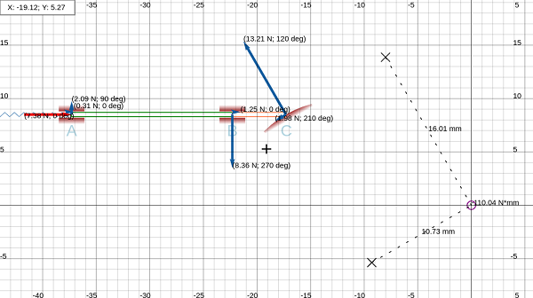

# ForceCalc

This app allows to calculate unknown reactions of supports and moment vector of the beam that loaded from the left by spring and has a smooth support at the right.

Software could be used by automotive designers that produce car's switches especially on the design stage. Switches like power window switches


or parking brake switch


ets.

This scheme reflects a simplified model of regular switches used inside cars.

.jpg)



It is a mechanical scheme that consists of:

 - two journal bearings (A & B) with free movement along X axis;
 - smooth support C at the right end of the beam;
 - beam placed between supports A & C; 
 - spring that generate external linear load on the beam's left side.

Contact field describes friction between beam and support C. First column is a friction coefficient (as an assumption we use [dry friction](https://en.wikipedia.org/wiki/Friction) laws). "X coordinate" and “Y coordinate” columns define position (mm) of support C compared to coordinate origin marked as purple circle.


Plunger field describes interaction between beam and supports A & B. First column is a friction coefficient (dry friction laws assumption is also applied here). “Distance A” indicates distance between B & C (mm), while “Distance B” - distance between A & B (mm).


Spring field describes linear spring characteristics (based on [Hooke's law](https://en.wikipedia.org/wiki/Hooke%27s_law)). “Stiffness” column contains spring [stiffness](https://en.wikipedia.org/wiki/Stiffness) in (N/mm), “Free length” - the length of the spring when uncompressed, “Length” - the length of the compressed spring.


Angles field consists of the following:  “Direction of normal reaction force” is an orientation of smooth support, “Direction of plunger friction forces” and “Direction of normal reaction friction force” are directions where friction forces were applied. The relative motion of the beam occurs in the directions opposite to friction forces.


In `ForceApp` you can find [settings.py](ForceApp/settings.py) where LOGIN_URL is specified for appropriate path


```
contact
plunger
spring
angles
```

[Hooke's law](https://en.wikipedia.org/wiki/Hooke%27s_law)
[Contribution guidelines for this project](requirements.txt)


- contact
- plunger
- spring
1. contact
   - first set
     - second set
3. plunger
4. spring
5. angles
 - [ ] Task 1. Calculate force
 - [x] Task 2. Calculate Torque #512
 - [ ] \(Optional) Build distances
Here is a simple footnote[^1].
<!-- This content will not appear in the rendered Markdown -->

[^1]: My reference.

@Dmytro-kur :+1: This PR looks great - it's ready to merge! :shipit:
